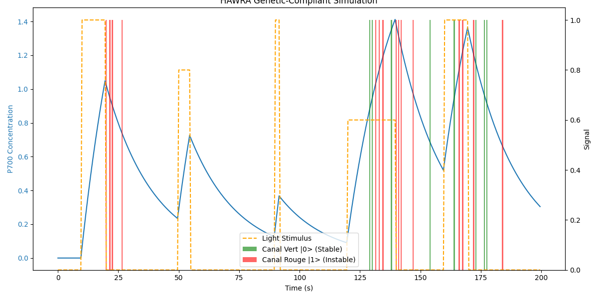

# HAWRA - Présentation Finale du Projet HAWRA

## 1. Introduction

Le projet HAWRA vise à développer une plateforme de calcul biologique capable d'exécuter des algorithmes complexes en exploitant les principes de la biologie synthétique et de la mécanique quantique. Ce document présente l'architecture du modèle, les résultats des simulations et les capacités d'orchestration développées.

**HAWRA** est un système intégré composé de trois piliers :
1.  **PQPE (Phyto-synthetic Quantum Processing Entity)** : Le matériel biologique (wetware).
2.  **BioOS** : Le système d'exploitation qui l'orchestre.
3.  **Système ARBOL** : L'écosystème de programmation pour le BioOS.

## 2. Architecture du Modèle

Le simulateur multiphysique est au cœur du projet HAWRA. Il intègre trois moteurs spécialisés pour modéliser le comportement complexe du système :

*   **Moteur Environnemental** : Simule les conditions externes, notamment les impulsions lumineuses qui servent de stimulus au système.
*   **Moteur Biologique** : Modélise la réponse génétique de la cellule, en particulier la concentration de la protéine P700 en réponse à la lumière.
*   **Moteur Quantique** : Décrit l'état quantique du P700, qui agit comme un qubit, et sa décohérence, qui se traduit par l'émission de signaux de luciférase.

## 3. Résultats de la Simulation

### 3.1. Réponse à une Impulsion Lumineuse Unique

Une première simulation a été réalisée pour valider la réponse du système à une série d'impulsions lumineuses. Le graphique ci-dessous montre la dynamique de la concentration de P700 et des signaux de luciférase en réponse aux stimuli lumineux.

### 3.2. Balayage des Paramètres

Pour explorer la robustesse et la sensibilité du modèle, un balayage des paramètres a été effectué. Les simulations ont été répétées pour différentes valeurs des taux de synthèse et de dégradation de la protéine P700. Les résultats montrent comment ces paramètres influencent la dynamique du système.

#### Faible Dégradation, Faible Synthèse (`deg_0.05_syn_0.2`)

Dans ce régime, la concentration de P700 augmente lentement et atteint un plateau modéré. Le système est stable mais peu réactif.

#### Dégradation Moyenne, Forte Synthèse (`deg_0.1_syn_1.0`)

Avec une forte synthèse, la concentration de P700 augmente rapidement et atteint des niveaux élevés. Le système est très réactif mais peut être sujet à la saturation.

#### Forte Dégradation, Synthèse Moyenne (`deg_0.2_syn_0.5`)

Une forte dégradation entraîne une diminution rapide de la concentration de P700 après chaque impulsion. Le système est très dynamique et réinitialise rapidement son état, ce qui peut être souhaitable pour des calculs rapides.

## 4. Orchestration ARBOL

Pour automatiser et gérer des campagnes de simulation complexes, des scripts d'orchestration ont été développés à l'aide du framework ARBOL. Ces scripts permettent de :

*   **Définir et exécuter des expériences uniques** avec des configurations spécifiques (`run_pulse_experiment.py`).
*   **Automatiser le balayage des paramètres** pour explorer l'espace des solutions (`run_parameter_sweep.py`).

Cette approche facilite la recherche reproductible et l'analyse à grande échelle du comportement du modèle.

## 5. Conclusion et Perspectives

Le projet HAWRA a permis de développer un simulateur multiphysique fonctionnel et des outils d'orchestration robustes. Les résultats des simulations valident l'architecture du modèle et démontrent sa capacité à reproduire des comportements biologiques et quantiques complexes.

Les prochaines étapes pourraient inclure :

*   L'intégration de modèles plus détaillés pour les processus biologiques et quantiques.
*   Le développement d'algorithmes d'apprentissage automatique pour analyser les résultats des simulations.
*   La validation expérimentale du modèle en laboratoire.
