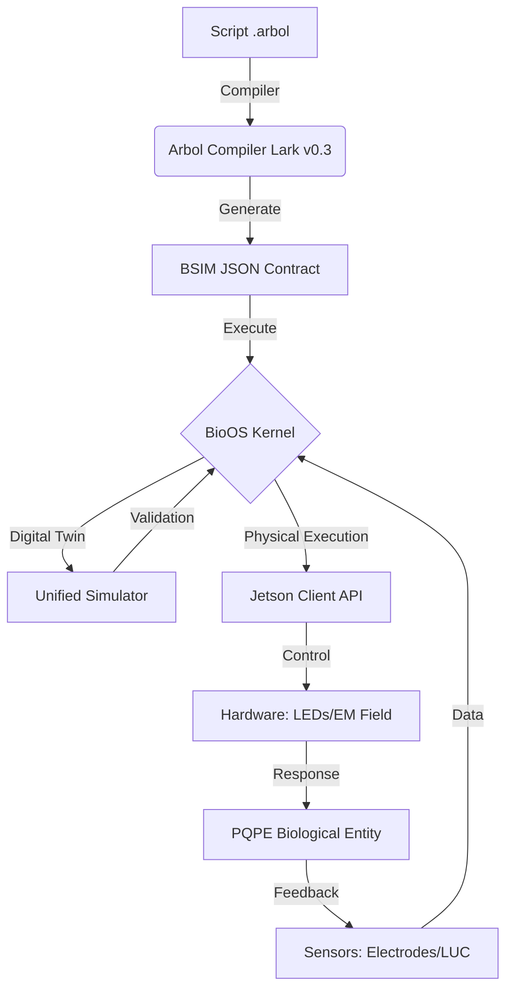
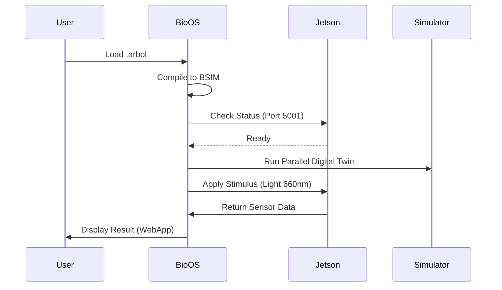
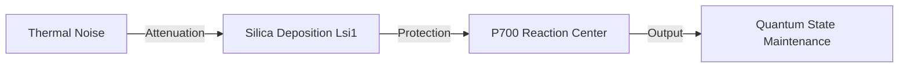

# Schémas et Diagrammes du Projet HAWRA

Ces schémas sont conçus pour être intégrés dans le papier scientifique via Mermaid.js ou TikZ.

## 1. Architecture Globale ARBOL → Hardware

## 2. Pipeline de Données Génomique

## 3. Workflow d'Exécution BioOS

## 4. Modèle de Couche d'Isolation (Silica Shield)

